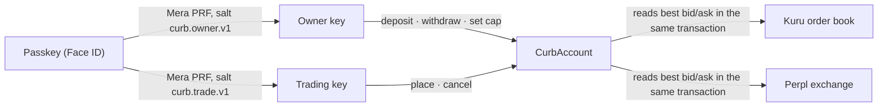

# Curb

**A trading key that can't withdraw, and can't trade off Kuru's live order book.**

Curb is a mobile-first web app for trading on Monad's onchain order books: [Kuru](https://kuru.io) spot (MON/USDC) and [Perpl](https://github.com/PerplFoundation/api-docs) perpetuals (MON, with AUSD margin). One passkey makes two keys:

- The **owner key** moves money in and out of the account. It is derived with Face ID for each action and never stored.
- The **trading key** places and cancels orders with no prompt. It can't withdraw, and it can't place an order more than 0.50% outside the venue's live best bid and ask.

A contract account, `CurbAccount`, enforces both limits onchain. It reads the venue's best bid and ask in the same transaction as each order. That check only works because Kuru's and Perpl's order books are contracts on Monad.

**Live app:** [curb-jet.vercel.app](https://curb-jet.vercel.app). It runs on Monad mainnet. Open it in Safari or Chrome rather than inside a social app's browser.

**Demo videos:**

- [Curb in 1:54](https://youtu.be/KTfEX9fxlMQ): the problem, the two keys, the lane, and three refusals, each followed by its mainnet transaction.
- [Trading perps from a phone, in 1:03](https://youtu.be/FOd77wVufD8): passkey login, AUSD through Kuru Flow, a long on Perpl, 10× refused, the close.
- [Mera as the account layer, in 0:56](https://youtu.be/F7ZPS6zysI8): one passkey prompt for both keys, the trading session, owner re-prompts, the stateless rebuild.

The app scenes in the videos were recorded on a fork of Monad mainnet with a test passkey, and each is labelled on screen. The mainnet transactions they show are in the table below.

Built for Monad Metropolis, Track 1: Onchain Finance & Trading.

## Proof on Monad mainnet

Each row is a mainnet transaction you can open. All of them came from one passkey on the builder's iPhone. The entries in [docs/EVIDENCE.md](docs/EVIDENCE.md) have the details.

| What happened | Transaction | Evidence |
|---|---|---|
| The trading key tried to withdraw. The account **refused** it (`NotOwner`). | [0x170cfbc0…](https://monadscan.com/tx/0x170cfbc0f63f16693590ad09eb94c082156e2053edfcc45c3c722dd5b04452a7) | E-019 |
| A buy priced past Kuru's lane. The account **refused** it (`OffLane`; the most a buy could pay at that block was 0.032260). | [0x785f6f98…](https://monadscan.com/tx/0x785f6f98fd29d9111abe6e5c7ef23e6db67344c1df67ee40da9c0768f612860a) | E-019 |
| 10× leverage over a 5× cap. The account **refused** it (`LeverageAboveCap`). | [0x447a071d…](https://monadscan.com/tx/0x447a071db272f701f72931e470ee9ea05be766a75a2c369da6672a6ddc3e79ab) | E-028 |
| A bid past Perpl's lane. The account **refused** it (`PerpOffLane`). | [0x2cca7e5e…](https://monadscan.com/tx/0x2cca7e5ef6070f62f629a40fe605bb72e70bfd5cb54ec98d4ac9100648e19b26) | E-028 |
| A 200 MON sell rested on Kuru and was then cancelled, both signed by the trading key with no prompt. | [place](https://monadscan.com/tx/0x2868a1db1f20c3ae95c4ec222584f989094417d670fbb57bd18f90c6bb382249) · [cancel](https://monadscan.com/tx/0x2e829c8e2f69771fee36ae3509944a83bb8800207b56aa7bd077c8e9d3450be8) | E-019 |
| A 300 MON long was opened and closed on Perpl by the trading key. | [open](https://monadscan.com/tx/0xd1a3350f73483057b8ef3df6d46809885cefabd8c8dabbeb1cf63389e4b1f235) · [close](https://monadscan.com/tx/0x297c374dd24e730478b26a4b8fd10aa39312db5d45ae26f58d1e33ed29f97ece) | E-028 |
| 354.08 MON was swapped for 11.86 AUSD through Kuru Flow, inside the app. | [0xc2ff8269…](https://monadscan.com/tx/0xc2ff8269618571e3a21a6880f902a5492975aced3a4733a6649f7acd325d6081) | E-028 |
| The owner key withdrew 200 MON with Face ID. | [0xcf4ce7af…](https://monadscan.com/tx/0xcf4ce7af3b9fe256516569dd0ee4f101e540015d306f838f27e72512616610f7) | E-019 |

The contracts' source is verified on Sourcify (exact match): [CurbFactory](https://monadscan.com/address/0xC3b37bfa0c4496005F01a9E92cD5d285398db000) (E-024) and the builder's [CurbAccount](https://monadscan.com/address/0x59C87e37a9bb219C517f01fd6cB3AdB5Cb7aFDB1) (E-028).

## How it works



- **Two keys from one passkey.** [Mera](https://www.npmjs.com/package/@category-labs/mera) turns the passkey's PRF output into keys. Each key comes from its own salt, so the trading key never holds the owner key's secret (D-012). A single Face ID evaluates both salts (D-030; E-032, and E-033 on iOS).
- **The account.** `CurbFactory` creates the `CurbAccount` at an address fixed by its two keys, so the address is known before it exists. The account holds the money on Kuru and Perpl and checks every call against its rules. Only the owner key can withdraw, change the trading key, choose the markets or set the leverage cap. The trading key can only place and cancel orders on those markets, inside the lane and under the cap.
- **The lane.** An order is in the lane when its price is between the venue's best bid − 0.50% and best ask + 0.50%. The account reads those prices from the book in the same transaction, so the check uses the book as it stands when the order lands, not as the app last saw it. The app draws the lane with the same formula and the same rounding (D-022).
- **The session.** One Face ID unlocks the trading key in memory for that tab. It locks when you tap Lock, close the tab, or leave it unused for 15 minutes, and the time left shows on screen. A key past its deadline can't sign, even if the phone slept through the timer (D-031, E-034).
- **No backend.** Orders and History are rebuilt from the chain. A fresh device finds every transaction either key sent by searching their nonces, then reads the venues' fills (D-029, E-030). On the builder's iPhone, in a private tab, the full history was back in 12.9 s (E-031).

## Why Monad

The lane is a price check against the live book, done inside the contract that places the order. It needs the order book to be onchain and cheap to read in the same transaction. On Monad, Kuru and Perpl are both full onchain order books, so `CurbAccount` can call `bestBidAsk()` on Kuru, or read Perpl's book, before it forwards an order. An exchange whose book lives offchain can give a key "trade but don't withdraw", but it can't let a third-party contract enforce "only near the real price".

It is also fast enough that prompt-free trading feels instant. From the builder's iPhone on mainnet, the trading key's orders and cancels confirmed in a median **1.4 s from tap to receipt** (90% within 1.8 s, 17 transactions). That covers signing, sending over a phone connection, the block and the receipt (E-038). The app prints each one as "Confirmed in 0.9 s".

## Mera is the whole account layer

- **No seed phrase, no wallet extension, no custody backend.** The passkey is the only secret, and the device's authenticator keeps it.
- **One prompt to start.** One Face ID makes both keys wherever the authenticator evaluates PRF at creation (E-032). Signing in on iOS takes one Face ID (E-033). From the landing page to the first confirmed transaction took 4 taps and 2 Face IDs: one for both keys, one for the owner key to create the account (E-032; funding the owner key not counted).
- **Prompt-free trading, scoped.** Orders and cancels sign without a prompt while the session is open. Every owner action (deposit, withdraw, the cap, sending MON) asks for Face ID every time (E-032, E-034).
- **The stateless test.** Clear the browser or switch devices: sign in with the passkey and the same two keys come back, the account is found onchain, and Orders and History are rebuilt (E-030, E-031, E-033).

## Demand

Exchanges already sell keys that can trade but can't withdraw. In 2022, keys like that leaked from 3Commas, and attackers drained $27.3M from 86 users by trading their balances into the attackers' own orders at prices nobody else would pay. Curb's account refuses exactly that kind of trade onchain. On Monad today, most orders on Kuru and Perpl are signed by keys that only pay gas, for contracts that hold the money. The full case, with sources and a script you can rerun, is in [docs/DEMAND.md](docs/DEMAND.md).

## Addresses (Monad mainnet, chain 143)

| Contract | Address |
|---|---|
| CurbFactory | [`0xC3b37bfa0c4496005F01a9E92cD5d285398db000`](https://monadscan.com/address/0xC3b37bfa0c4496005F01a9E92cD5d285398db000) |
| CurbAccount (the builder's) | [`0x59C87e37a9bb219C517f01fd6cB3AdB5Cb7aFDB1`](https://monadscan.com/address/0x59C87e37a9bb219C517f01fd6cB3AdB5Cb7aFDB1) |
| Kuru MON/USDC order book | [`0x065C9d28E428A0db40191a54d33d5b7c71a9C394`](https://monadscan.com/address/0x065C9d28E428A0db40191a54d33d5b7c71a9C394) |
| Kuru MarginAccount | [`0x2A68ba1833cDf93fa9Da1EEbd7F46242aD8E90c5`](https://monadscan.com/address/0x2A68ba1833cDf93fa9Da1EEbd7F46242aD8E90c5) |
| Perpl exchange (MON perpetual, id 10) | [`0x34B6552d57a35a1D042CcAe1951BD1C370112a6F`](https://monadscan.com/address/0x34B6552d57a35a1D042CcAe1951BD1C370112a6F) |
| AUSD | [`0x00000000eFE302BEAA2b3e6e1b18d08D69a9012a`](https://monadscan.com/address/0x00000000eFE302BEAA2b3e6e1b18d08D69a9012a) |

## Run it

The app (Next.js) reads Monad mainnet through the public RPC and needs no env vars:

```bash
cd web
npm ci
npm run dev     # http://localhost:3000
npm test        # unit tests
```

The contracts (Foundry 1.8.3) are tested on a fork of Monad mainnet:

```bash
cd contracts
MONAD_RPC_URL=https://rpc.monad.xyz forge test
```

To try trades without spending real money, run a fork and point the app at it:

```bash
anvil --fork-url https://rpc.monad.xyz --network monad --block-time 1
NEXT_PUBLIC_MONAD_RPC_URL=http://127.0.0.1:8545 NEXT_PUBLIC_MONAD_WS_URL=ws://127.0.0.1:8545 npm run dev
```

Then fund your keys on the fork with `anvil_setBalance`. [docs/CONTEXT.md](docs/CONTEXT.md) lists the traps, for example freezing the fork's clock so Perpl accepts taking orders.

## Repository

| Path | What's there |
|---|---|
| `contracts/` | `CurbAccount`, `CurbFactory` and their fork tests against Monad mainnet |
| `web/` | The app: passkeys through Mera, viem, Kuru and Perpl reads and writes |
| `docs/EVIDENCE.md` | What has been proven and how: transactions, commands, captures |
| `docs/DECISIONS.md` | Why things are the way they are |
| `docs/CONTEXT.md` | Verified facts about Monad, Kuru, Perpl and Mera, and the traps hit |
| `docs/DEMAND.md` | The demand research and the onchain sample |

## Limits

- **The lane bounds price, not frequency.** A stolen trading key could still trade back and forth inside the lane, losing up to about 0.50% plus fees per round trip. It can't withdraw, and it can't trade at a price the attacker sets.
- **Two markets.** Kuru MON/USDC and Perpl's MON perpetual. Deposits to Kuru are MON only (D-018).
- **No audit.** The contracts are verified and fork-tested against mainnet (E-021), not audited.
- **Getting AUSD in the app** uses Kuru Flow's quote API to find a route. Monad prices it before you sign (D-026, D-027). AUSD sent from outside works without it.
- **A first visit on a new device** takes about 20 s to read your history on the public RPC (E-030).
- **Creating a new passkey on iOS in one Face ID is unverified.** Signing in on iOS is one Face ID (E-033).
- **No outside users yet.** Every Curb transaction on mainnet is the builder's own.

## AI disclosure

This project was built with AI coding assistance (Claude Code), as the Metropolis rules (§4.1.4) permit and require us to disclose. Design decisions and their reasons are in [docs/DECISIONS.md](docs/DECISIONS.md). The demo videos were also made with AI: the agent edited them in Remotion, and the narration is an AI voice from [elevenlabs.io](https://elevenlabs.io) (D-034).

## License

[MIT](LICENSE)
